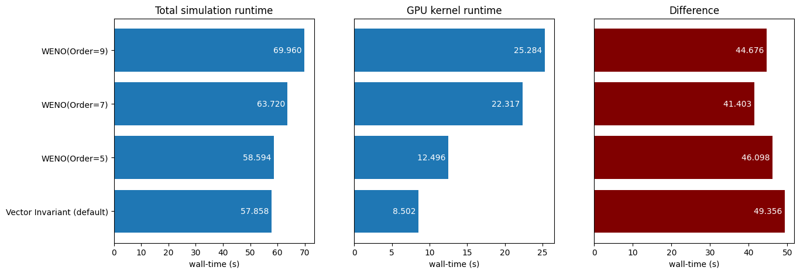
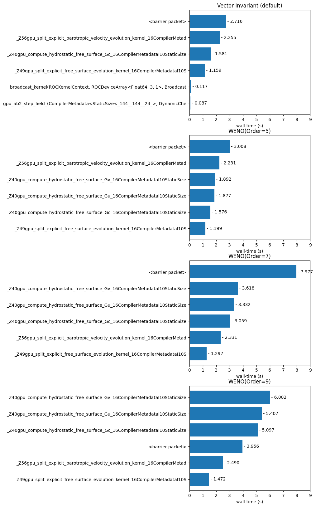
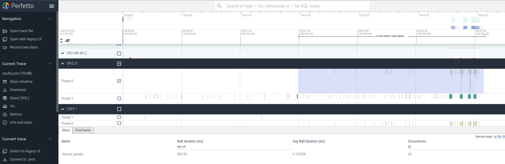
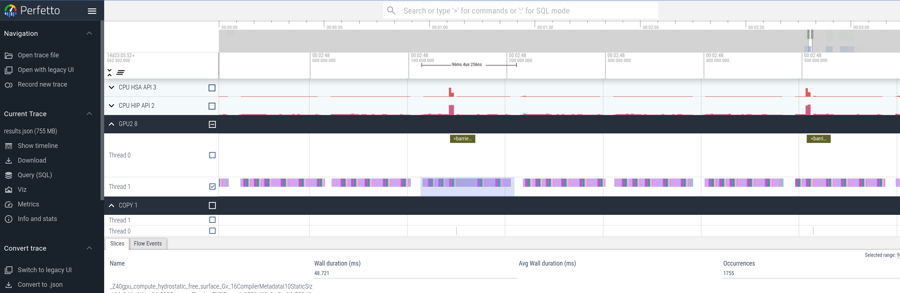
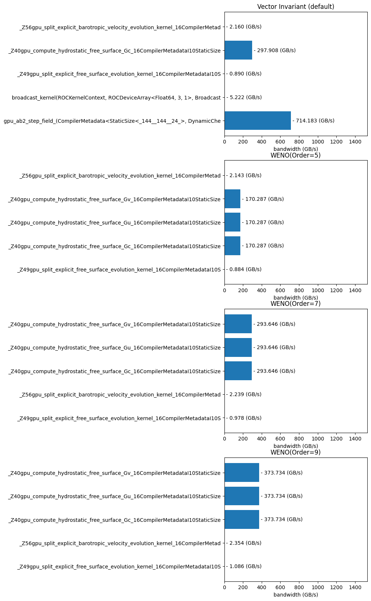

# Oceananigans port to AMD GPUs and Benchmarking

AMD GPU support is added to Oceananigans using Julia extensions that allows users to set the `grid` architecture to `GPU(AMDGPU.ROCBackend())` when `using Oceananigans, AMDGPU` is included in a Julia script. Initial porting supports only the hydrostatic free surface models with a split explicit free surface. We use the baroclinic adjustment example as a test bed for assessing performance on AMD GPUs.

## Compute Platforms

### Noether (AMD MI210)
Supermicro 4214GS-TNR
4x AMD MI210 - GPUs 0-1 on NUMA domain 0, GPUs 2-3 on NUMA domain 1
2x AMD EPYC...
PCIe v4 x16


## Benchmark
We use a fork of Oceananigans at commit 205b4c.. An active [pull request](https://github.com/CliMA/Oceananigans.jl/pull/3475) is in place to merge this contribution into the main branch of Oceananigans.

We use a modified version of the `baroclinic_adjustment.jl` example. The modifications we apply are as follows

* Increase the number of grid cells to 144x144x24
* Time step size is reduced to maintain CFL of 0.2 with a max time step of 10 minutes
* Total simulation time is set to 10 days

We are interested in understanding the achieved total simulation runtime as a function of the advection scheme and underlying hardware. To help understand why the runtimes are so achieved, we also look at hot spot profiles to indicate which kernels on the GPU occupy the majority of the runtime,  hardware events profiles to obtain measures of achieved memory bandwidth and L2 Cache Hit performance, and static kernel analysis to show register usage and registers spills to estimate theoretical occupancy. Together, this provides some hints about how to improve performance of slower model configurations (particularly the higher order advection schemes)


```python
! python3 --version
! python3 -m pip install matplotlib pandas
```

    Python 3.10.12
    Defaulting to user installation because normal site-packages is not writeable
    Requirement already satisfied: matplotlib in /home/joe/.local/lib/python3.10/site-packages (3.6.3)
    Requirement already satisfied: pandas in /home/joe/.local/lib/python3.10/site-packages (2.2.1)
    Requirement already satisfied: pillow>=6.2.0 in /home/joe/.local/lib/python3.10/site-packages (from matplotlib) (9.4.0)
    Requirement already satisfied: python-dateutil>=2.7 in /home/joe/.local/lib/python3.10/site-packages (from matplotlib) (2.8.2)
    Requirement already satisfied: fonttools>=4.22.0 in /home/joe/.local/lib/python3.10/site-packages (from matplotlib) (4.38.0)
    Requirement already satisfied: pyparsing>=2.2.1 in /usr/lib/python3/dist-packages (from matplotlib) (2.4.7)
    Requirement already satisfied: kiwisolver>=1.0.1 in /home/joe/.local/lib/python3.10/site-packages (from matplotlib) (1.4.4)
    Requirement already satisfied: cycler>=0.10 in /home/joe/.local/lib/python3.10/site-packages (from matplotlib) (0.11.0)
    Requirement already satisfied: packaging>=20.0 in /home/joe/.local/lib/python3.10/site-packages (from matplotlib) (21.3)
    Requirement already satisfied: contourpy>=1.0.1 in /home/joe/.local/lib/python3.10/site-packages (from matplotlib) (1.0.7)
    Requirement already satisfied: numpy>=1.19 in /home/joe/.local/lib/python3.10/site-packages (from matplotlib) (1.26.4)
    Requirement already satisfied: pytz>=2020.1 in /usr/lib/python3/dist-packages (from pandas) (2022.1)
    Requirement already satisfied: tzdata>=2022.7 in /home/joe/.local/lib/python3.10/site-packages (from pandas) (2024.1)
    Requirement already satisfied: six>=1.5 in /usr/lib/python3/dist-packages (from python-dateutil>=2.7->matplotlib) (1.16.0)


```python

# Here, we create a list object that gives each configuration a nice readable name and pairs
# that with the local folder containing the benchmark and profile output.
advection_schemes = [{'name': 'Vector Invariant (default)',
                      'folder': 'large-144x144x24/vectorinvariant_default'},
                     {'name': 'WENO(Order=5)',
                      'folder': 'large-144x144x24/weno5'},
                     {'name': 'WENO(Order=7)',
                      'folder': 'large-144x144x24/weno7'},
                     {'name': 'WENO(Order=9)',
                      'folder': 'large-144x144x24/weno9'}]

```

## Bulk Runtimes
At first, we're interested in understanding the differences in simulation runtime as a function of the advection scheme while running on a fixed hardware architecture; here, this is the AMD MI210 GPU. Performing a simulation includes grid generation, initial condition setup, file IO, and data visualization in addition to the actual forward stepping of the model. Oceananigans is set up so that model integration (forward stepping) is completely resident on the GPU.  When performing file IO and data visualization, data is copied from the device to the host where it is written to disk (file IO) and rendered (visualization). This incurs additional overhead on the simulation that is not reflective of the speed of the GPU kernels used for tendency calculation for the momentum and tracer equations. Because of this, we are also interested in the total amount of time spent in GPU kernel execution, which provides a clear measure of the impact an advection scheme has on the forward integration of the model.


```python
# Here, we get the bulk runtime for each simulation.
# When we run the benchmark, we have a batch script that runs the code without a profiler,
# runs the code with hotspot profiling, runs the code with trace profiling, and runs the code with events profiling.
# We can "grep" through the stdout file for each simulation for the lines containing "Simulation completed in" and
# extract the total runtime for the first output, corresponding to the runtime without any profiling.

import re

pattern_s = r"Simulation completed in (\d+\.\d+) seconds"
pattern_m = r"Simulation completed in (\d+\.\d+) minutes"

k=0
for a in advection_schemes:
    file = open(f"{a['folder']}/stdout", "r")

    for line in file:
        match_s = re.search(pattern_s,line)
        match_m = re.search(pattern_m,line)
        
        if match_s:
            runtime=float(match_s.group(1))
            print(f"{a['name']} : {runtime}")
            advection_schemes[k]['runtime_s'] = runtime
            break
            
        if match_m:
            runtime=float(match_m.group(1))
            print(f"{a['name']} : {runtime*60}")
            advection_schemes[k]['runtime_s'] = runtime*60
            break
        
    k+=1
```

    Vector Invariant (default) : 57.858
    WENO(Order=5) : 58.594
    WENO(Order=7) : 63.720000000000006
    WENO(Order=9) : 69.96


## Sum of GPU kernel execution times
While total simulation time is helpful for assessing the impacts on "time-to-science", this also can include other activities, like memory copies between host and device, other host routine execution, kernel launch overhead, etc. Because the advection routines run solely on the GPU, we can look directly at the GPU kernel runtimes obtained from the hotspot profiles. Since changing the advection scheme changes the name of the kernels, we cannot easily compare kernel-by-kernel runtimes for each advection scheme. Instead, we can compute the sum of all of the GPU kernel runtimes for each simulation.


```python
import pandas as pd
import numpy as np

k=0
for a in advection_schemes:
    file = open(f"{a['folder']}/results.stats.csv", "r")
    data = pd.read_csv(file)
    total_gpu_kernel_runtime_s = data['TotalDurationNs'].sum()*1e-9
    advection_schemes[k]['total_gpu_kernel_runtime_s'] = total_gpu_kernel_runtime_s
    k+=1
    print(f"{a['name']} : {total_gpu_kernel_runtime_s}")
    
```

    Vector Invariant (default) : 8.502129968
    WENO(Order=5) : 12.495811275000001
    WENO(Order=7) : 22.316686742
    WENO(Order=9) : 25.283880806000003


Notice that there is a fairly large difference between the total simulation runtime and the total time spent in executing GPU kernels. Below, we gather the total simulation runtime, the total time spent executing GPU kernels, and their difference and plot them together.


```python
import matplotlib.pyplot as plt

k=0
schemes = []
runtimes = np.zeros(len(advection_schemes))
total_gpu_kernel_runtimes = np.zeros(len(advection_schemes))
for a in advection_schemes:
    schemes.append(a['name'])
    total_gpu_kernel_runtimes[k] = a['total_gpu_kernel_runtime_s']
    runtimes[k] = a['runtime_s']
    k+=1

sim_time_minus_kernel_time_s = runtimes - total_gpu_kernel_runtimes

fig, ax = plt.subplots(1,3, figsize=(15,5))

y_pos = np.arange(len(schemes))

# creating the bar plot
ax[0].barh(y_pos, runtimes)
ax[0].set_yticks(y_pos, labels=schemes) 
ax[0].set_xlabel("wall-time (s)")
ax[0].set_title("Total simulation runtime")
for y in y_pos:
    ax[0].text(runtimes[y], y, f'{runtimes[y]:.3f} ', color='white', ha='right', va='center')


# creating the bar plot
ax[1].barh(y_pos, total_gpu_kernel_runtimes)
ax[1].yaxis.set_tick_params(labelleft=False)
ax[1].set_yticks([])
ax[1].set_xlabel("wall-time (s)")
ax[1].set_title("GPU kernel runtime")
# add labels to bar plot for runtime
for y in y_pos:
    ax[1].text(total_gpu_kernel_runtimes[y], y, f'{total_gpu_kernel_runtimes[y]:.3f} ', color='white', ha='right', va='center')

# creating the bar plot
ax[2].barh(y_pos, sim_time_minus_kernel_time_s, color='maroon' )
ax[2].yaxis.set_tick_params(labelleft=False)
ax[2].set_yticks([])
ax[2].set_xlabel("wall-time (s)")
ax[2].set_title("Difference")
# add labels to bar plot for runtime
for y in y_pos:
    ax[2].text(sim_time_minus_kernel_time_s[y], y, f'{sim_time_minus_kernel_time_s[y]:.3f} ', color='white', ha='right', va='center')

plt.show()
```


    

    


What comes as no surprise is that higher order advection schemes come with higher computational costs. The default vector invariant scheme is the least expensive and conservation form with 9th Order WENO is the most expensive. Now, the question is why.

## Hotspot profiles

Hotspot profiles are a list of the kernels/routines that are launched during the execution of a program, ordered with by the total amount of time spent in each. This is useful for determining where to focus attention for software optimization efforts. Here, we look at the top 5 kernels according to their total runtime for each simulation.


```python
import pandas as pd
import numpy as np
import matplotlib.pyplot as plt

topn=6
k=0
for a in advection_schemes:
    file = open(f"{a['folder']}/results.stats.csv", "r")
    data = pd.read_csv(file)
    advection_schemes[k]['hotspot_profile'] = {'name':data['Name'].str[:75][0:topn],'calls':data['Calls'][0:topn],'total_duration_s':data['TotalDurationNs'][0:topn]*1e-9}
    k+=1
    
y_pos = np.arange(topn)

fig, ax = plt.subplots(4,1, figsize=(5,20))
for k in range(len(schemes)):
    #ax.flatten()[k].grid()
    #ax.flatten()[k].set_axisbelow(True)
    ax.flatten()[k].barh(-y_pos, advection_schemes[k]['hotspot_profile']['total_duration_s'].values)
    ax.flatten()[k].set_yticks(-y_pos, labels=advection_schemes[k]['hotspot_profile']['name']) 
    ax.flatten()[k].set_xlabel("wall-time (s)")
    ax.flatten()[k].set_title(advection_schemes[k]['name'])
    ax.flatten()[k].set_xlim((0,9))
    for y in y_pos:
       ax.flatten()[k].text(advection_schemes[k]['hotspot_profile']['total_duration_s'][y], -y, f" - {advection_schemes[k]['hotspot_profile']['total_duration_s'][y]:.3f}", color='black', ha='left', va='center')
    
```


    

    


## Trace profile
We can see that each simulation has a call to `<barrier packet>`. For the low order methods, it shows up as the most expensive kernel. To understand what this kernel is, we turn to a trace profile, which provides a visualization of the timeline of activity during the execution of the program. To create a trace profile, we use `rocprof --sys-trace julia --project=. baroclinic_adjustment.jl`. The `--sys-trace` instructs rocprof to capture a trace profile that is (by default) stored in a filed called `results.json`. This file can be visualized at https://ui.perfetto.dev . To keep the trace profile small enough ( < 1 GB ), we reduce the simulation time to 2 days. Below is a screen shot of the trace profile.



The trace profile shows a timeline of activity on the GPU, with time increasing from left to right. The rows labeled GPU2 8 Thread 0 and Thread 1 correspond to kernels executed on the GPU. Colored rectangles on the timeline correspond to a period of time when gpu kernel activity is taking place. With rocprof, any "white space" (empty space) corresponds to activity that is taking place on the CPU, which can include execution of host kernels or synchronization/wait operations. The rows labeled COPY 1 Thread 1 and Thread 0 correspond to activity where data is copied between the host and device. The highlighted portion of the timeline, on thread 0, shows the barrier packet execution, which corresponds with the execution of memory copy transactions for Thread 0. Beneath this highlighted section, the larger (more noticeable) green rectangles on the timeline correspond to groupings of tendency kernel calculations executed back-to-back; a zoomed in view of this segment of the timeline is shown below.


From the zoomed in view, we can see a set of tightly packed kernels executed back-to-back over ~100 ms. The most expensive kernel in this grouping is the `compute_hydrostatic_free_surface_Gv` calculation, followed by `compute_hydrostatic_free_surface_Gu` and `compute_hydrostatic_free_surface_Gc`. Additionally, we can see the barrier packet execution occuring concurrently with kernel execution. This suggests asynchronous memory copies are being used; you can see the memory copy at the same time level as the barrier packet on the bottom row of the zoomed in trace profile. Because the barrier packet is executed asynchronously with the kernels we care about, we ignore it in the hotspot profile.

## Achieved bandwidth
While the time it takes to run the simulation is likely the most important to the end user, the kernel runtimes (both in total and individually) shown above provide some indication of the influence that the developers can have on the total simulation runtime. Of course, other activities like file IO and data visualization can easily swamp a simulation's wall time, but this is an issue that is out of the Oceananigan developer's hands (aside from sharing some best practices). While I recognize that performance is not the top priority to every Oceananigan'er, I would argue that is in the project's best interest to review the possibility that performance may be left on the table. 

On the outset, I assume that this finite volume code is memory bandwidth bound, meaning that the aritmetic intensity of the most expensive kernels is such that their achieved performance is bounded by the ability of the GPU to feed data from global memory to the compute units on the GPU. Because of this, we look towards estimating the achieved bandwidth for the top 5 kernels for each simulation and compare this with empirical measurements of global memory bandwidth from the [mixbench microbenchmark](https://github.com/ekondis/mixbench). For information on how we use this benchmark to estimate peak bandwidth and compute performance, see [this Slurm batch script](https://github.com/PawseySC/performance-modelling-tools/blob/main/examples/mixbench/noether/ekondis-mixbench.sh), developed through work sponsored by Pawsey Supercomputing Centre as part of a series of mentored sprints.

Below we show the peak sustained bandwidth (GB/s) and max compute performance (GB/s) achieved with double precision vector fused-multiply-adds on the AMD MI210 GPUs. Achieved performance and bandwidth for kernels in Oceananigans are measured relative to these empirically measured figures. 


```python
# Read the mixbench report for "Noether" (Fluid Numerics' MI210 system)
file = open(f"mixbench/noether.csv", "r")
data = pd.read_csv(file)

float64_df = data.loc[data['Data Type'] == "float64"]
float64_bw = float64_df['Bandwidth (GB/s)'].max()
float64_gflops = float64_df['GFLOPS'].max()
print(f"(AMD MI210) Max Bandwidth (float64)           : {float64_bw} (GB/s)")
print(f"(AMD MI210) Max Compute Performance (float64) : {float64_gflops} (GFLOPS)")
print(f"(AMD MI210) Critical AI (float64)             : {float64_gflops/float64_bw} (FLOPS/byte)")
```

    (AMD MI210) Max Bandwidth (float64)           : 1532.16 (GB/s)
    (AMD MI210) Max Compute Performance (float64) : 20325.94 (GFLOPS)
    (AMD MI210) Critical AI (float64)             : 13.266199352548036 (FLOPS/byte)


To obtain a measure of achieved bandwidth for kernels in Oceananigans, we need to estimate the number of bytes read from and written to global memory during each kernel execution in addition to the kernel runtime. `rocprof` allows you to obtain this information through hardware counters; the metrics of interest are `FETCH_SIZE` and `WRITE_SIZE`, which provides the amount of memory read from and written to global memory (respectively) in KB during kernel execution. To instruct `rocprof` to collect these metrics, we create a text file called `events.txt` with the following contents

```
pmc: FETCH_SIZE, WRITE_SIZE
```

We then profile the benchmark application with

```
rocprof -i events.txt julia --project=. ./baroclinic_adjustment.jl
```

This creates a flat profile called `events.csv`. Each row in this csv file contains our desired metrics for each kernel as they are executed chronologically. Because capturing hardware events incurs some profiling overhead, we also create a flat profile with no hardware events and only capture the start and end times of each kernel. This is done using the following

```
rocprof --timestamp on julia --project=. baroclinic_adjustment.jl
```

The `--timestamp on` flag forces the capture of start and end times of each kernel and stores the output in `results.csv`. We can then merge the contents of `events.csv` and `results.csv` to obtain estimates of achieved bandwidth (in GB/s) by doing the following calculation

```python
runtime_s = (end_time_ns - start_time_ns)*1e-9
rw_gb = (fetch_size + write_size)*1e-6
achieved_bandwidth_gbs = rw_gb/runtime_s
```

To help simplify things, we focus on calculating the achieved bandwidth only for our top five kernels.


```python
j = 0
for a in advection_schemes:
    file = open(f"{a['folder']}/events.csv", "r")
    events_df = pd.read_csv(file)

    file = open(f"{a['folder']}/results.csv", "r")
    results_df = pd.read_csv(file)

    # Loop over our top kernels from the hotspot profile
    mean_bw = np.zeros(len(a['hotspot_profile']['name']))
    names = []
    k = 0
    for kernel in a['hotspot_profile']['name'].values:
       if kernel != '<barrier packet>':
           print(f"{a['name']} : {kernel}")
           names.append(kernel)
           # Filter down the dataframe to only look at entries for this specific kernel
           kernel_events = events_df[events_df['KernelName'].str.contains(kernel[:6])]
           kernel_results = results_df[results_df['KernelName'].str.contains(kernel[:6])]
    
           # Calculate the bandwidth in (GB/s)
           runtime_s = (kernel_results['EndNs'] - kernel_results['BeginNs'])*1e-9
           rw_gb = (kernel_events['FETCH_SIZE'] + kernel_events['WRITE_SIZE'])*1e-6
           bw_gbs = rw_gb/runtime_s
    
           # Compute bandwidth statistics
           mean_bw[k] = bw_gbs.mean() # Calculate the mean bandwidth
           print(f"mean bandwidth : {mean_bw[k]} GB/s")
           k+=1

    advection_schemes[j]['metrics'] = {'name':names,
                                       'mean_gbs':mean_bw[:k]}
    j+=1
        
```

    Vector Invariant (default) : _Z56gpu_split_explicit_barotropic_velocity_evolution_kernel_16CompilerMetad
    mean bandwidth : 2.159902189169789 GB/s
    Vector Invariant (default) : _Z40gpu_compute_hydrostatic_free_surface_Gc_16CompilerMetadataI10StaticSize
    mean bandwidth : 297.9080702151498 GB/s
    Vector Invariant (default) : _Z49gpu_split_explicit_free_surface_evolution_kernel_16CompilerMetadataI10S
    mean bandwidth : 0.8900643737053839 GB/s
    Vector Invariant (default) : broadcast_kernel(ROCKernelContext, ROCDeviceArray<Float64, 3, 1>, Broadcast
    mean bandwidth : 5.222138954976954 GB/s
    Vector Invariant (default) : gpu_ab2_step_field_(CompilerMetadata<StaticSize<_144__144__24_>, DynamicChe
    mean bandwidth : 714.1833077621883 GB/s
    WENO(Order=5) : _Z56gpu_split_explicit_barotropic_velocity_evolution_kernel_16CompilerMetad
    mean bandwidth : 2.142847639941507 GB/s
    WENO(Order=5) : _Z40gpu_compute_hydrostatic_free_surface_Gv_16CompilerMetadataI10StaticSize
    mean bandwidth : 170.2868577354162 GB/s
    WENO(Order=5) : _Z40gpu_compute_hydrostatic_free_surface_Gu_16CompilerMetadataI10StaticSize
    mean bandwidth : 170.2868577354162 GB/s
    WENO(Order=5) : _Z40gpu_compute_hydrostatic_free_surface_Gc_16CompilerMetadataI10StaticSize
    mean bandwidth : 170.2868577354162 GB/s
    WENO(Order=5) : _Z49gpu_split_explicit_free_surface_evolution_kernel_16CompilerMetadataI10S
    mean bandwidth : 0.8844638333799194 GB/s
    WENO(Order=7) : _Z40gpu_compute_hydrostatic_free_surface_Gv_16CompilerMetadataI10StaticSize
    mean bandwidth : 293.6460282590906 GB/s
    WENO(Order=7) : _Z40gpu_compute_hydrostatic_free_surface_Gu_16CompilerMetadataI10StaticSize
    mean bandwidth : 293.6460282590906 GB/s
    WENO(Order=7) : _Z40gpu_compute_hydrostatic_free_surface_Gc_16CompilerMetadataI10StaticSize
    mean bandwidth : 293.6460282590906 GB/s
    WENO(Order=7) : _Z56gpu_split_explicit_barotropic_velocity_evolution_kernel_16CompilerMetad
    mean bandwidth : 2.239260506803575 GB/s
    WENO(Order=7) : _Z49gpu_split_explicit_free_surface_evolution_kernel_16CompilerMetadataI10S
    mean bandwidth : 0.978029695554503 GB/s
    WENO(Order=9) : _Z40gpu_compute_hydrostatic_free_surface_Gv_16CompilerMetadataI10StaticSize
    mean bandwidth : 373.73392513420106 GB/s
    WENO(Order=9) : _Z40gpu_compute_hydrostatic_free_surface_Gu_16CompilerMetadataI10StaticSize
    mean bandwidth : 373.73392513420106 GB/s
    WENO(Order=9) : _Z40gpu_compute_hydrostatic_free_surface_Gc_16CompilerMetadataI10StaticSize
    mean bandwidth : 373.73392513420106 GB/s
    WENO(Order=9) : _Z56gpu_split_explicit_barotropic_velocity_evolution_kernel_16CompilerMetad
    mean bandwidth : 2.354021139650876 GB/s
    WENO(Order=9) : _Z49gpu_split_explicit_free_surface_evolution_kernel_16CompilerMetadataI10S
    mean bandwidth : 1.0860238630876147 GB/s


```python

# Here, we plot the achieved bandwidth for each kernel for each simulation


fig, ax = plt.subplots(4,1, figsize=(5,20))
for k in range(len(schemes)):
   
    y_pos = np.arange(len(advection_schemes[k]['metrics']['mean_gbs']))
    ax.flatten()[k].barh(-y_pos, advection_schemes[k]['metrics']['mean_gbs'])
    ax.flatten()[k].set_yticks(-y_pos, labels=advection_schemes[k]['metrics']['name']) 
    ax.flatten()[k].set_xlabel("bandwidth (GB/s)")
    ax.flatten()[k].set_title(advection_schemes[k]['name'])
    ax.flatten()[k].set_xlim((0,float64_bw))
    for y in y_pos:
       ax.flatten()[k].text(advection_schemes[k]['metrics']['mean_gbs'][y], -y, f" - {advection_schemes[k]['metrics']['mean_gbs'][y]:.3f} (GB/s)", color='black', ha='left', va='center')
    
```


    

    


## Kernel analysis
The plots shown above purposefully set the x-limits of the plot from 0 to the max sustained bandwidth measured with a microbenchmark (~1.5 TB/s) to illustrate the amount of performance still left on the table. 

For many GPU accelerated applications, it's helpful to further characterize a kernel's utilization of the hardware. With regards to memory usage, we are primarily interested in whether or not we are effectively using the L2 Cache; a low cache hit can be indicative of memory access patterns that are not optimal. One of the main benefits of running on GPU hardware is that a GPU is capable of keeping thousands of threads in flight, which can be beneficial for latency hiding (as one group of threads waits for instructions to complete, another group can be swapped in to execute instructions). However, overconsumption of finite resources on the compute units of a GPU (registers and shared memory) will cause the GPU's scheduler to reduce the number of threads in flight, limiting the benefits of latency hiding. The measure of the actual number of threads in flight divided by the total possible for a GPU architecture is referred to as the **occupancy**. Last, it's possible that the problem size is too small to really keep the GPU busy with each kernel launch and we should not really hope to reach the peak bandwidth for small problems; as we saw in the trace profile, each kernel execution is fairly quick. We can check in on the problem size issue if we are able to determine the theoretical occupancy for a kernel (how many total threads can be resident on the GPU) and how many threads are required for completing the execution of a kernel. If the number of threads required to execute a kernel is low in comparison tto the maximum number of threads that can be supported on the GPU (after accounting for occupancy), then it's likely we'll want to benchmark with a larger problem size as well.
